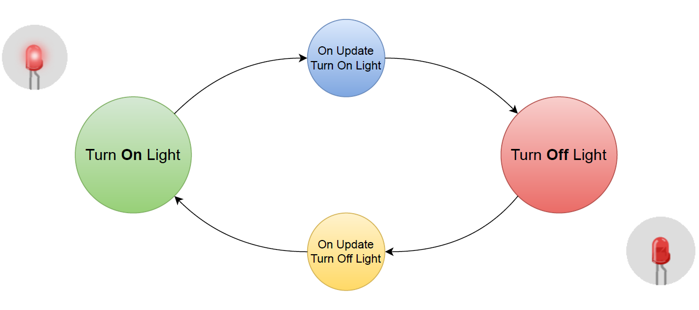

=================================
State Machine for Robot Framework
=================================

.. image:: https://circleci.com/gh/marcinooo/robot-framework-state-machine/tree/main.svg?style=svg
    :target: https://circleci.com/gh/marcinooo/robot-framework-state-machine/?branch=main

|

:Author: marcinooo
:Tags: Robot Framework, Python, State Machine, Library

:abstract:

   Implementation of state machine in robot framework.

.. contents ::

Description
===========

Library contains implementation of state machine
to control or test software components which can be in many states.

Documentation
-------------

It is a very simple library, so the documentation is included here. 
For the inquisitive I recommend reading the docstrings in `file <https://github.com/marcinooo/robot-framework-state-machine/blob/develop/src/StateMachineLibrary/interface.py>`_.

First of all import the library:

.. code:: robotframework

    Library  StateMachineLibrary

Create a state machine:

.. code:: robotframework

    Create State Machine  name=blink-machine

You can create as many as you want state machines. Each state machine should have a unique name.

Register keywords that should be executed in the given state (*Turn On Light*) and during its update (*On Update Turn On Light*):

.. code:: robotframework

    Add State  state=Turn On Light   on_update=On Update Turn On Light   sm=blink-machine

Both keywords must be defined:

.. code:: robotframework

    *** Keywords ***
    # ...
    Turn On Light
        # ...

    On Update Turn On Light
        Go To State  state=Turn Off Light  sm=blink-machine

Keywords *On Update...* should indicate the next state:

.. code:: robotframework

    Go To State  state=Turn Off Light  sm=blink-machine

Call the same kewyord to enter the first state.

Force transition to a new state:

.. code:: robotframework

    Update State  sm=blink-machine

You can pass data between states in **context** (recommended method) or using global variables.

.. code:: robotframework

    *** Keywords ***
    # ...
    Turn On Light
        # ...
        &{context_chunk}=    Create Dictionary    led_status=ON
        Update Context    sm=blink-machine    item=${context_chunk}

    Turn Off Light
        # ...
        &{context}=    Get Context  sm=blink-machine
        Log To Console    LED is ${context["led_status"]}

Usage
=====

An example of using the library for LED blinking (of course, the library was created for more complex tasks :wink:).

.. code:: robotframework

    *** Settings ***
    Library  StateMachineLibrary

    *** Tasks ***
    Blink
        [setup]  Task Setup
        Go To State  state=Turn On Light  sm=blink-machine
        Repeat Keyword  100 times  Update State  sm=blink-machine

    *** Keywords ***
    Task Setup
        Create State Machine  name=blink-machine
        Add State  state=Turn On Light   on_update=On Update Turn On Light   sm=blink-machine
        Add State  state=Turn Off Light  on_update=On Update Turn Off Light  sm=blink-machine

    Turn On Light
        Log To Console  Turn On Light...
    #    Sleep    0.5s    # if you have real led then you need this ;)

    On Update Turn On Light
        Go To State  state=Turn Off Light  sm=blink-machine

    Turn Off Light
        Log To Console  Turn Off Light...
    #    Sleep    0.5s    # if you have real led then you need this ;)

    On Update Turn Off Light
        Go To State  state=Turn On Light   sm=blink-machine

Flow diagram:

Installation
============

Install from github:

``$ pip install git+https://github.com/marcinooo/robot-framework-state-machine``

License
=======

license_ (MIT)

.. _license: https://github.com/marcinooo/robot-framework-state-machine/blob/main/LICENSE.txt
